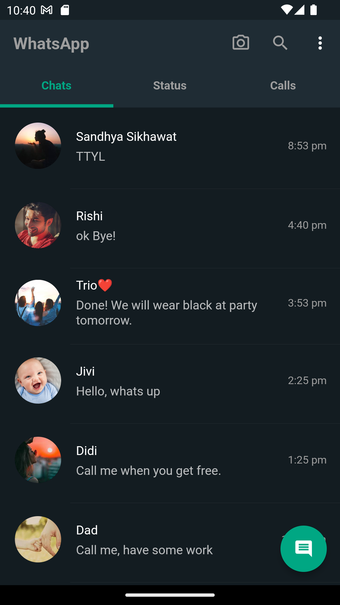
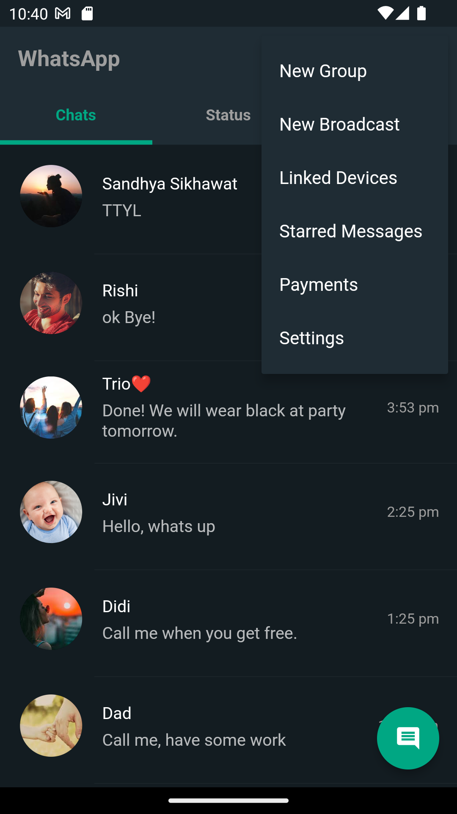
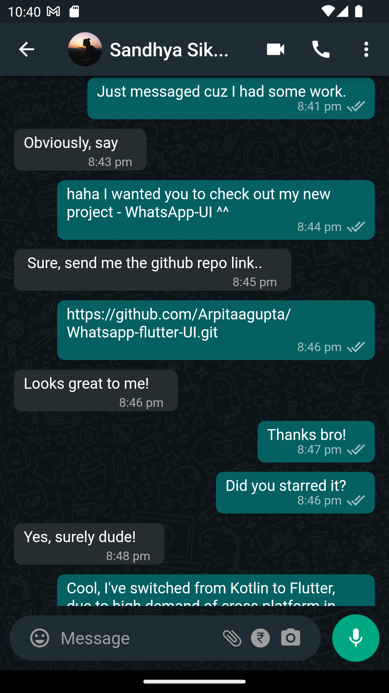
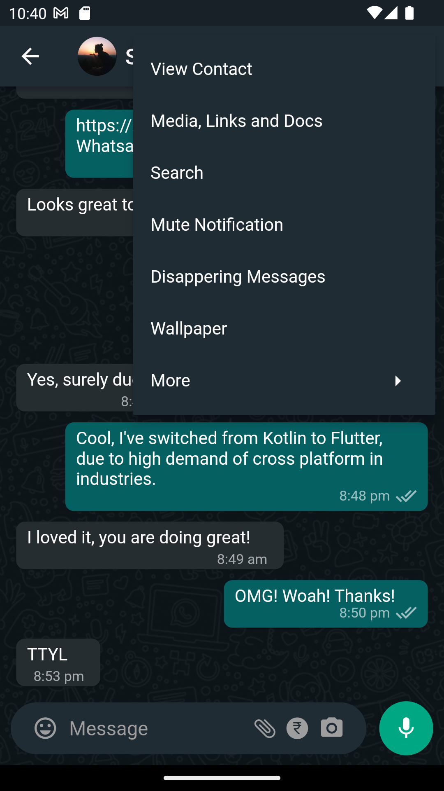
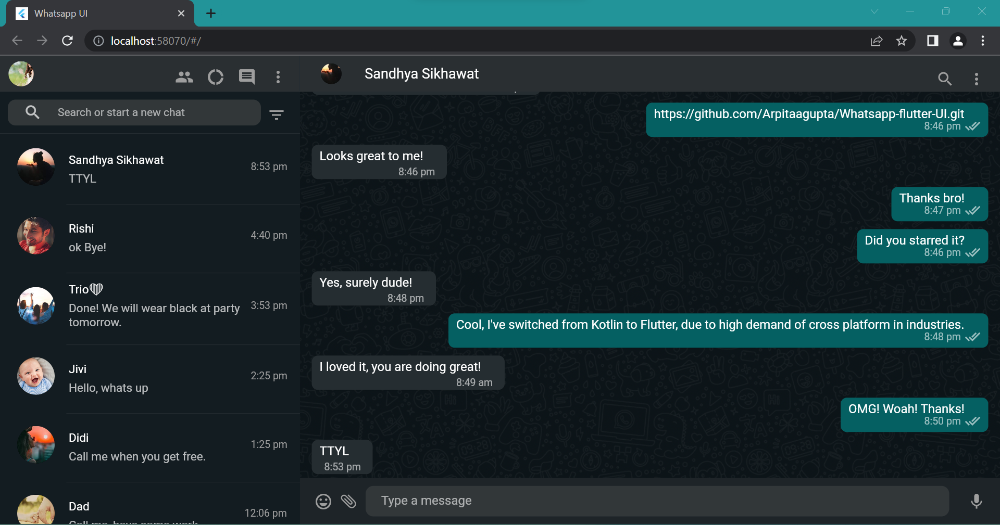
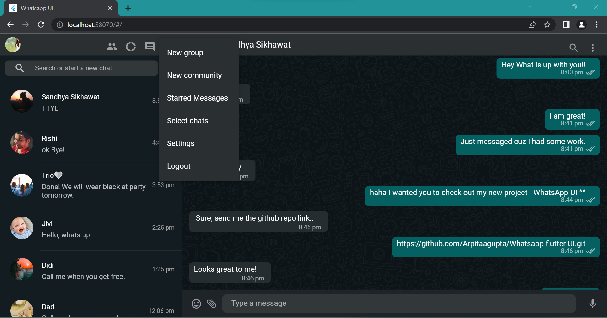
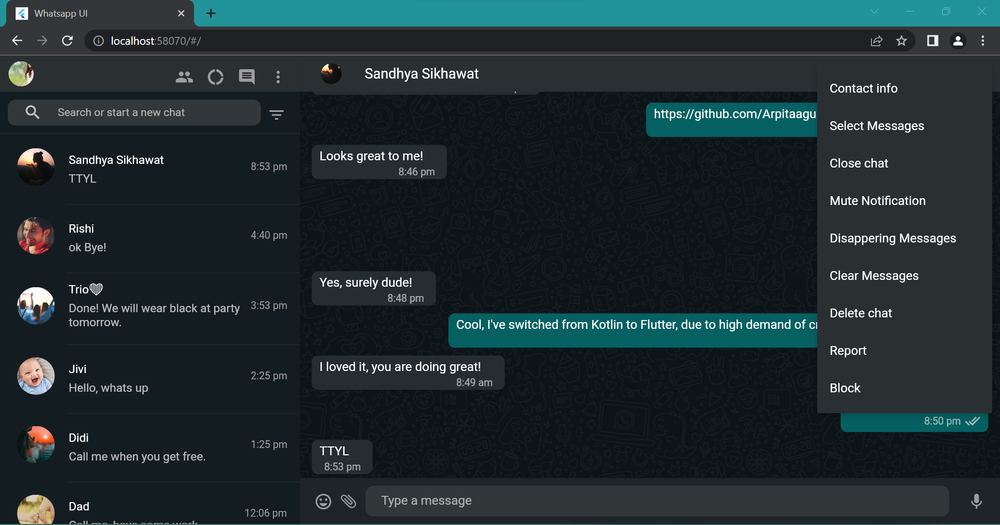

<div align="center">
  <a href="[https://hoppscotch.io](https://www.whatsapp.com/)">
    
  </a>
  <br />
  <p>
    <h3>
      <b>
        WhatsApp UI
      </b>
    </h3>
  </p>

[](https://opensource.org/licenses/MIT)   <a href="CODE_OF_CONDUCT.md" alt="Contributions welcome">
    </a>
    
</div>

# 🌟 Introduction
A WhatsApp user interface clone built with Flutter. This project aims to replicate the look and feel of the popular messaging app, WhatsApp, using the Flutter framework.

## 🚀 Features

- Chat list with avatar, name, and last message preview.
- Chat screen with a header containing avatar, name, and additional options.
- Interactive chat input box with icons for emojis, attachments, currency, and camera.
- Popup menus for additional options, such as view contact, media, links and docs, search, mute notification, disappearing messages, and wallpaper.
- Voice messaging feature for sending and receiving audio messages.

## 📸 Screenshots

## Screenshots from Mobile Phone :
      

## Screenshots from Web :
 



## 👉 Prerequisites

Before running this project, make sure you have the following prerequisites set up on your system:
1. **Flutter SDK:** Follow the official Flutter installation guide to install Flutter on your machine: [Flutter Installation](https://flutter.dev/docs/get-started/install)
2. **Dart SDK:** Flutter relies on the Dart programming language, so make sure you have Dart SDK installed. It is typically installed automatically with Flutter.
3. **VS Code:** Download and install Visual Studio Code from the official website: [VS Code](https://code.visualstudio.com/) .

## ⚒️ Installation and Usage

1. Clone the repository:
``` 
git clone https://github.com/Arpitaagupta/Whatsapp-flutter-UI.git 
```

2. Navigate to the project directory:
``` 
cd whatsapp_flutter_ui
```

3. Install the dependencies:
```
flutter pub get
```

4. Run the app:
```
flutter run
```

## 🤝 Contributing

Found a bug? 🐛
Want to add a cool new feature? 🤔

Your contributions can help improve the WhatsApp Flutter UI project and make it even better.✨

<hr>
<p align="center">
Contributions  are welcomed from all developers!❤️
</p>